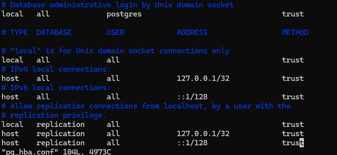

# DB setup

For simplicity of setup and assuming that postgresql, we will remove the postgres user password: So, in the file pg_hba.conf we will change it to:

After that, execute the database setup script:

* If you use linux: run "sh setup_linux.sh"
* If you use Windows: execute "setup_windows.bat"
  
Independly of the OS, this will run the "setup.sql", which will create the database, the table that we will use and it will fill it with some example data.

# Architecture of the system
The architecture of the project at the end looks like this.

The project has two main clases, that handles the main business logic:

* ShopClient: Client that the main users will use
* ShopServer: Server that will be deployed in some machine

Then there is some auxiliary clases:

* JsonManager: That will analyze the jsons that ShopClient recevies, and searches for errors.
* SalesDao: That will separate the business logic with the db logic.
* Calculator: This class will handle the calculation of poitns and final price.

And only one database table:
* sales_history table, this will handle all the data that we need for our example scenario of this activity.

# How to run the code
In order to run the code, we need to:

1. Run the main method of the server, located in "src/main/kotlin/io/grpc/shop/server/ShopServer.kt"
2. Run the main method of the client, located in "src/main/kotlin/io/grpc/shop/client/ShopClient.kt"

This will run always the two different remote procedures of the service (getPoints and getSales) in sequence .

# How to run different test cases
Finally, to test different test cases we can:

* If we want to test the remote procedure that returns the points and the final price of a sale, we can modify "PointsExample.json" with a new case.
* If instead of testing that, we want to test the remote procedure that returns the sales in a given period, we can modigy the "SalesExmple.json" with a new case.

This was done like this again, for testing simplicity, in a real life scenario, we could be listening to an endpoint, call it in a method whenever is needed or even with  button.

# Example of a normal 
A full execution will look like the following picture

